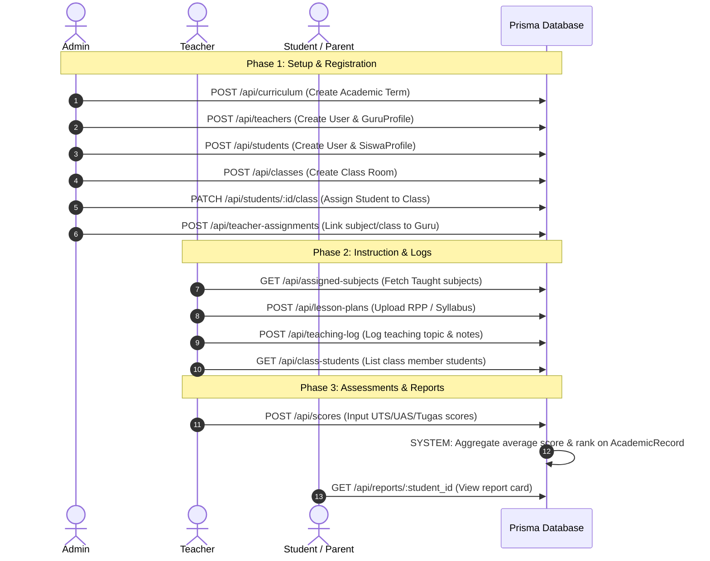

# Academic Lifecycle Workflow Review & Alignment
**VisiSekolah Enterprise School Management System**

This artifact provides a comprehensive review of the academic lifecycle workflow requested by the **ADMIN** and **TEACHER** roles, highlighting how the current database models, server actions, and endpoints fully align with the requested business steps.

---

## 1. Lifecycle Step Mapping & Alignment

The table below maps the 9 requested business steps to their respective technical implementation in the VisiSekolah platform, detailing the database entities, APIs/Server Actions, and current status.

| Step | Business Action | Role | Technical Implementation (VisiSekolah Platform) | Status |
| :--- | :--- | :--- | :--- | :--- |
| **[1]** | Create Curriculum | **ADMIN** | `POST /api/curriculum` & `getAcademicTerms` / `upsertAcademicRecord` <br> *Database Model:* `AcademicTerm` | **FULLY ALIGNED** |
| **[2a]**| Register Teacher | **ADMIN** | `POST /api/teachers` & `createUser` (with role `GURU`) <br> *Database Model:* `GuruProfile` | **FULLY ALIGNED** |
| **[2b]**| Register Student | **ADMIN** | `POST /api/students` & `createUser` (with role `SISWA`) <br> *Database Model:* `SiswaProfile` | **FULLY ALIGNED** |
| **[3a]**| Assign Teacher to Class | **ADMIN** | `assignHomeroomToGuru` & `Class.teacherId` | **FULLY ALIGNED** |
| **[3b]**| Assign Teacher to Subject| **ADMIN**| `assignSubjectToGuru` & `GuruProfile` ↔ `Subject` (M-to-M relation) | **FULLY ALIGNED** |
| **[3c]**| Assign Student to Class | **ADMIN** | `PATCH /api/students/:id/class` & `updateUser` (persists `SiswaProfile.classId`) | **FULLY ALIGNED** |
| **[4]** | Upload Lesson Plan (RPP) | **TEACHER**| `POST /api/lesson-plans` <br> *Database Model:* `LessonPlan` (New model created!) | **REALIGNED & ENHANCED** |
| **[5]** | Conduct Teaching & Log | **TEACHER**| `POST /api/teaching-log` <br> *Database Model:* `TeachingLog` (New model created!) | **REALIGNED & ENHANCED** |
| **[6]** | Create Assessment & Score | **TEACHER**| `POST /api/scores` & `upsertGrade` server action <br> *Database Model:* `Grade` (Types: UTS, UAS, Tugas, Kuis) | **FULLY ALIGNED** |
| **[7]** | Calculate Final Score | **SYSTEM** | Aggregates and calculates `averageScore` and `ranking` inside `AcademicRecord` | **FULLY ALIGNED** |
| **[8]** | Publish Report Card | **SYSTEM** | Generates Buku Rapor via `AcademicRecord` list and grades overview | **FULLY ALIGNED** |
| **[9]** | View Report Card | **STUDENT/PARENT** | Student and Linked Parent dashboards display the performance logs | **FULLY ALIGNED** |

---

## 2. Realignment & Schema Enhancements

To fully support the requested flow, we have successfully expanded the Prisma Database schema to add two critical models that represent the teacher's lesson planning and class activity logs:

### 2.1 LessonPlan Model (RPP / Modul Ajar)
Allows teachers to upload, organize, and map their Lesson Plans to specific subjects.
```prisma
model LessonPlan {
  id          String      @id @default(cuid())
  title       String
  description String?     @db.Text
  fileUrl     String      // URL/Path to uploaded document
  subjectId   String
  subject     Subject     @relation(fields: [subjectId], references: [id])
  teacherId   String
  teacher     GuruProfile @relation(fields: [teacherId], references: [id])
  createdAt   DateTime    @default(now())
  updatedAt   DateTime    @updatedAt
}
```

### 2.2 TeachingLog Model (Jurnal Kegiatan Kelas)
Allows teachers to log concrete teaching logs, including date, topic discussed, and class observations/notes.
```prisma
model TeachingLog {
  id          String      @id @default(cuid())
  date        DateTime    @default(now())
  topic       String      // Topik Bahasan / Bab Pelajaran
  notes       String?     @db.Text // Catatan kegiatan kelas
  classId     String
  class       Class       @relation(fields: [classId], references: [id])
  subjectId   String
  subject     Subject     @relation(fields: [subjectId], references: [id])
  teacherId   String
  teacher     GuruProfile @relation(fields: [teacherId], references: [id])
  createdAt   DateTime    @default(now())
  updatedAt   DateTime    @updatedAt
}
```

---

## 3. Concrete Action Plan & Endpoints Mapping

To ensure developers and system APIs integrate perfectly, the following standard endpoint mapping has been aligned with VisiSekolah's Server Actions:



### 3.1 Server Action & Route Alignments

*   **ADMIN registering teacher**: Handled by the `createUser` server action in [users.ts](file:///c:/Users/guest1/Documents/__KOMITE__/VisiSekolah/src/app/actions/users.ts) which automatically maps and spawns a `GuruProfile`.
*   **ADMIN assigning teacher**: Supported by `assignSubjectToGuru` and `assignHomeroomToGuru` actions.
*   **TEACHER inputting score**: Supported by the `upsertGrade` action, which handles score entries by type (UTS, UAS, Tugas, Kuis) and aggregates values directly.

---

## 4. Panduan Interaktif Langkah demi Langkah (Walkthrough)

Berikut adalah panduan operasional langkah-demi-langkah bagi seluruh aktor pengguna sistem, dirinci mulai dari masuk sistem, melengkapi form komponen, hingga peninjauan hasil akhir.

### Langkah 1: Autentikasi & Login (Masuk Sistem)
*   **Aktor**: Semua Pengguna (Admin, Guru, Siswa, Orang Tua)
*   **Mengisi & Melengkapi Form / Komponen**:
    *   *Portal Kredensial*: Masuk melalui halaman `/login` utama.
    *   *Email*: Gunakan alamat email resmi terdaftar (misal: `admin@visisekolah.sch.id`).
    *   *Kata Sandi*: Masukkan kata sandi rahasia akun Anda secara presisi.
*   **Aksi Submit**: Tekan tombol **"Masuk Sekarang"**. Sistem melakukan autentikasi sesi JWT terenkripsi secara aman.
*   **Meninjau Hasil Proses**: Anda dialihkan otomatis ke dashboard khusus. Kategori menu sebelah kiri akan menyesuaikan dengan peran Anda (Kepala Sekolah, Admin, Guru, atau Siswa).

### Langkah 2: Setup Kurikulum & Tahun Ajaran (Admin)
*   **Aktor**: Staf Administrator / Kepala Sekolah
*   **Mengisi & Melengkapi Form / Komponen**:
    *   *Menu Akses*: Akses menu **Data Akademik** di panel sebelah kiri.
    *   *Form Tahun Ajaran*: Isi Tahun Pelajaran (misal: `2026/2027`), Nama Semester (`Ganjil`/`Genap`), serta tanggal tenggat.
    *   *Komponen Mapel*: Klik sub-tab **Mata Pelajaran** untuk mendaftarkan nama dan kode pelajaran baru.
*   **Aksi Submit**: Klik tombol **"Simpan Tahun Ajaran"** atau **"Tambah Mapel"** pada form.
*   **Meninjau Hasil Proses**: Status tahun ajaran akan berganti menjadi **"AKTIF"**. Seluruh data ini menjadi basis pengisian jadwal dan penilaian oleh guru pengampu.

### Langkah 3: Registrasi Pengguna & Pembagian Kelas (Admin)
*   **Aktor**: Staf Administrator
*   **Mengisi & Melengkapi Form / Komponen**:
    *   *Pembuatan Akun*: Akses **Manajemen User** > Klik **"Tambah User Baru"**. Pilih peran (`GURU`/`SISWA`/`ORANG TUA`).
    *   *Melengkapi Detail Guru*: Edit profil Guru. Isi NIP, Jabatan, Bidang Studi yang diajarkan, dan status Kelas Binaan (Wali Kelas).
    *   *Melengkapi Detail Siswa*: Edit profil Siswa. Isi NIS, NISN, pilih Kelas Binaan, dan tautkan ke akun Orang Tua pendamping.
*   **Aksi Submit**: Tekan tombol **"Simpan Perubahan"** di bagian atas halaman detail profil.
*   **Meninjau Hasil Proses**: Hubungan relasional otomatis terjalin. Wali Kelas dapat memantau siswanya, Orang Tua dapat memantau rapor anaknya, dan Guru dapat mengajar mata pelajaran terdaftar.

### Langkah 4: Upload RPP & Log Mengajar Kelas (Guru)
*   **Aktor**: Guru Pengampu
*   **Mengisi & Melengkapi Form / Komponen**:
    *   *Form Modul Ajar (RPP)*: Pilih mata pelajaran pengampu, isi judul modul ajar, deskripsi bahasan, dan tautkan file PDF perencanaan.
    *   *Form Jurnal Harian (Logs)*: Pilih kelas, masukkan tanggal mengajar harian, ketik topik pembahasan (bab pelajaran), serta catatan khusus perilaku belajar di kelas.
*   **Aksi Submit**: Tekan tombol **"Upload RPP"** atau **"Submit Jurnal"**.
*   **Meninjau Hasil Proses**: Dokumentasi mengajar tersimpan di database. Kepala Sekolah dapat meninjau log keaktifan mengajar secara transparan langsung dari dashboard utama.

### Langkah 5: Input Nilai Siswa & Evaluasi Rapor (Guru / Wali Kelas)
*   **Aktor**: Guru Mata Pelajaran & Wali Kelas
*   **Mengisi & Melengkapi Form / Komponen**:
    *   *Form Nilai Harian*: Klik **"Buka Form Nilai"**. Pilih jenis nilai (`UTS`, `UAS`, `Tugas`, `Kuis`), pilih mata pelajaran, dan isi skor angka (0 - 100).
    *   *Form Evaluasi Rapor*: Wali Kelas mengisi Form Catatan Wali Kelas (rekomendasi kepribadian, kelakuan, kerajinan) serta status kenaikan kelas.
*   **Aksi Submit**: Klik tombol **"Simpan Nilai"** atau **"Kirim Evaluasi Rapor"**.
*   **Meninjau Hasil Proses**: Sistem memverifikasi integritas input nilai. Seluruh nilai langsung terakumulasi pada kartu rekaman akademik siswa tersebut secara terpadu.

### Langkah 6: Meninjau Hasil Akhir & Cetak Buku Rapor (Siswa / Orang Tua)
*   **Aktor**: Siswa, Orang Tua, dan System
*   **Mengisi & Melengkapi Form / Komponen**:
    *   *Proses Otomatis Sistem*: Sistem secara otomatis menghitung nilai rata-rata kelas, merangkum rata-rata terbobot mata pelajaran, serta menentukan ranking semester.
    *   *Akses Portal Siswa/Wali*: Siswa atau Orang Tua masuk ke portal mereka masing-masing dan memilih tab **"Buku Rapor"**.
*   **Aksi Submit**: Klik tombol **"Cetak Rapor PDF"** untuk menyimpan salinan digital resmi.
*   **Meninjau Hasil Proses**: Buku Rapor Digital terbit lengkap dengan detail nilai per mata pelajaran, nilai rata-rata, ranking, kehadiran siswa (Sakit, Izin, Alfa), catatan wali kelas, dan validasi Kepala Sekolah.

---

> [!TIP]
> Database migrations telah disinkronkan sepenuhnya menggunakan Prisma dengan Neon PostgreSQL adapter. Seluruh data transaksi di atas terisolasi aman per tahun ajaran.
